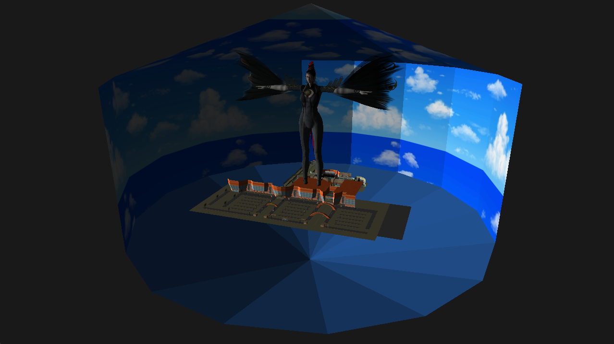
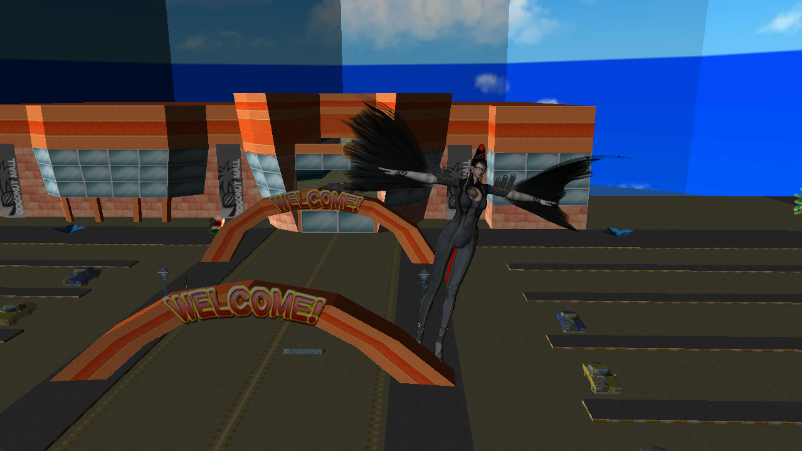

# OpenGL-OBJ-Renderer
This program was created as a part of a Computer Graphics course for the study Applied Computer Science at the Rotterdam University of Applied Sciences.
This program is a basic .obj file viewer with basic material support for difuse textures using .mtl files.
It can be used to load 3D meshes from a .obj file, which can be rotated, scaled, and moved across the scene.
The program also loads normal maps for detailed shadows, but I haven't applied them using shaders, becouse I was still figuring out what would be the right way to implement them.

<h3>Controls</h3>
  Middle Mouse button         = Rotate camera 
  Shift + Middle Mouse button = Move camera 

  Left Mouse button   = Revert transformations & select object 
  Right Mouse button  = Deselect objects 

  o   = Toggle orbit camera 

  While an object is selected: 
  g   = Move mode 
  r   = Rotation mode 
  s   = Scale mode 
  
<h3>Note:</h3>
The .obj files used in this project are acquired from https://www.models-resource.com/. I do not own the rights to any of these 3D models, and I am just using them for testing and demonstating purposes.  

Bayonetta model: https://www.models-resource.com/xbox_360/bayonetta/model/7928/ 
Coconut Mall model: https://www.models-resource.com/3ds/mariokart7/model/9997/ 

<h3>Example Images</h3>

